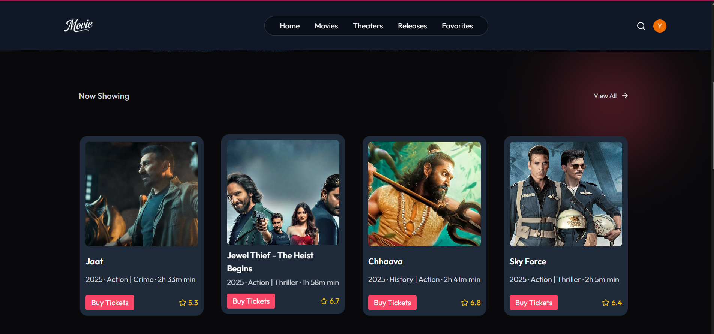
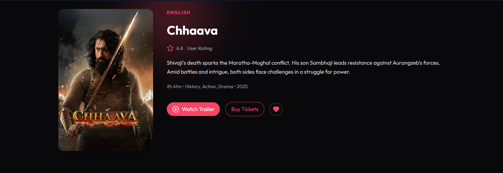
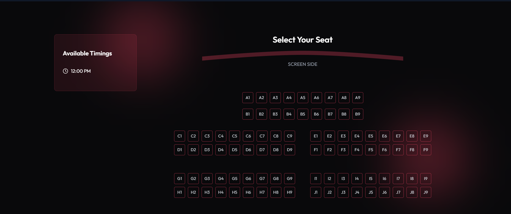

# 🎬 Movie Booking App

A full-stack Movie Booking Application where users can explore movies, check show timings, and book tickets. Admins can manage movies, showtimes, and user bookings through a separate dashboard.

---

## 🚀 Live Demo

🔗 [View Live](https://your-deployment-link.com)

---

## 📸 Screenshots

| Home Page                         | Movie Details Page                | Booking Page                      |
|----------------------------------|----------------------------------|-----------------------------------|
|  |  |  |  |


---

## ✨ Features

### 👥 User Side
- View all currently running movies.
- See movie details, descriptions, and show timings.
- Book tickets for selected shows.
- Login/Signup functionality.
- View personal bookings and booking history.

### 🛠️ Admin Side
- Admin authentication and protected routes.
- Add new movies with posters, descriptions, and timings.
- Manage all movie listings.
- View all user bookings in dashboard.

---

## 🧰 Tech Stack

### 💻 Frontend
- React.js
- Tailwind CSS
- React Router
- Axios

### 🖥️ Backend
- Node.js
- Express.js
- MongoDB
- Mongoose
- JWT Authentication
- Multer (for image upload if any)

---

## 📂 Folder Structure

Movie_Booking/
├── frontend/ # React Frontend
│ ├── public/
│ └── src/
├── backend/ # Node.js + Express Backend
│ ├── models/
│ ├── routes/
│ ├── controllers/
│ └── server.js
└── README.md


---

## 🔧 Local Setup Guide

Follow these steps to run the project locally on your machine.

### 🖥️ Prerequisites
- Node.js installed
- MongoDB connection string (MongoDB Atlas or local)
- Vite (optional, for frontend dev server)

---

### 1️⃣ Backend Setup

```bash
cd backend
npm install

MONGO_URL=your_mongodb_connection_string
JWT_SECRET=your_jwt_secret

#start the backend server
npm start

```
### Frontend Setup

```bash
cd ../frontend
npm install
VITE_BACKEND_URL=http://localhost:5000
npm run dev
Frontend runs on http://localhost:5173

```

🔐 Authentication

This project uses JWT-based authentication:

User and Admin login available.

Admin routes are protected.

👨‍💻 Author
Yash Rana
📧 yashrana2200520100072@gmail.com
Iet Lucknow


